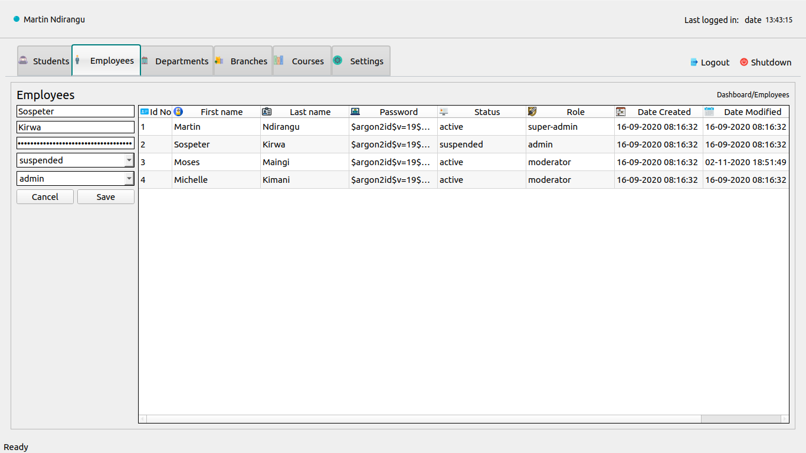
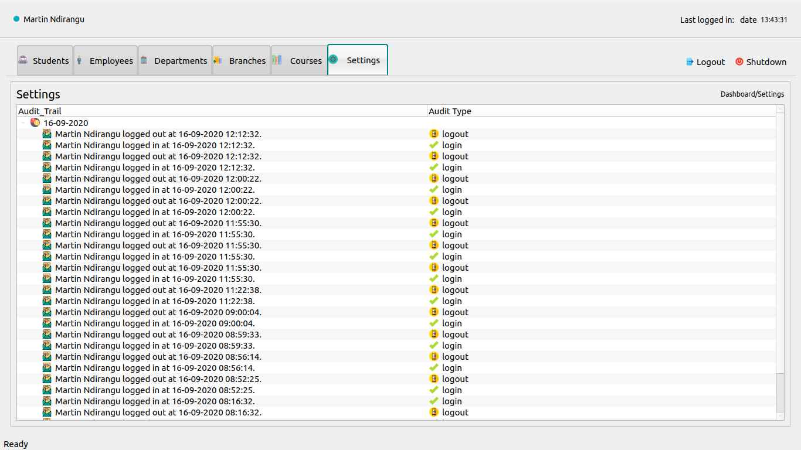
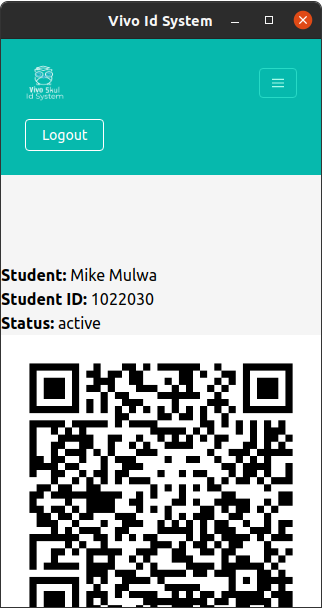

# Vivo Id Processing System

This is a simple system for processing QRCodes to serve as a means of digital identity for students. It is a GUI based Python and Flask Backend with a PyQT5 admin front-end and a HTML, Javascript, Tailwind CSS student front-end.

### To run
1. cd to main folder
2. python3 api/run.py
3. python3 src/main.py

### Screenshots

